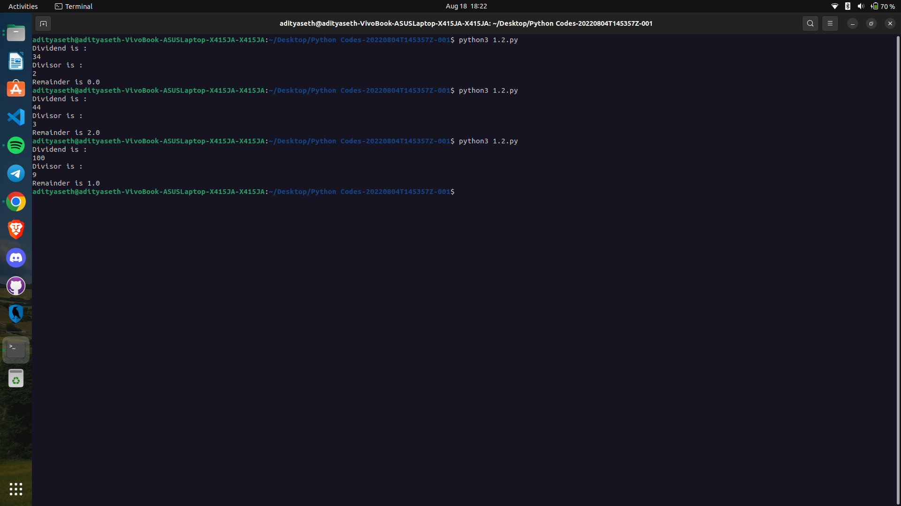

Question -> Divide two numbers in Python

```
Explanation ->
The given Python script calculates the remainder when one number (dividend) is divided by another number (divisor). Here's a step-by-step explanation of the solution:

a = input("Dividend is :\n"): This line prompts the user to enter the dividend, which is the number being divided. The input() function is used to receive user input as a string, and the entered value is assigned to the variable a.

fa = float(a): The float() function is used to convert the value of a from a string to a floating-point number. This step is necessary to perform arithmetic operations later.

b = input("Divisor is :\n"): Similarly, this line prompts the user to enter the divisor, which is the number that divides the dividend. The entered value is assigned to the variable b.

fb = float(b): The value of b is converted from a string to a floating-point number using the float() function.

fr = fa % fb: This line calculates the remainder when fa (dividend) is divided by fb (divisor) using the modulo operator %. The modulo operator returns the remainder of the division operation.

print("Remainder is", fr): Finally, this line prints the calculated remainder. The print() function is used to display the output, which includes the string "Remainder is" followed by the value of fr.

The script takes two numbers (dividend and divisor) as input, calculates the remainder when the dividend is divided by the divisor, and then displays the remainder to the user.
```

Output ->
