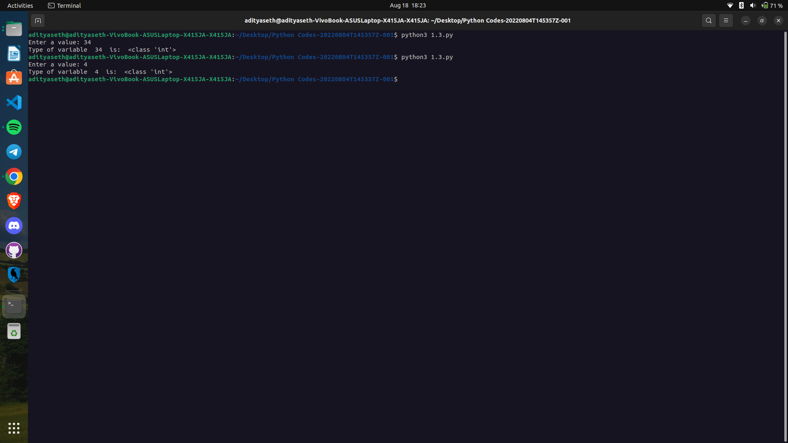

```
Explanation ->
The given Python script prompts the user to enter a value, assigns it to the variable a, and then determines the type of the variable. Let's break down the steps:

a = int(input("Enter a value: ")): This line prompts the user to enter a value. The input() function is used to receive user input as a string, and the entered value is converted to an integer using the int() function. The resulting integer value is assigned to the variable a.

print("Type of variable ", a, " is: ", type(a)): This line prints the type of the variable a. The print() function is used to display the output. The string "Type of variable " is concatenated with the value of a, followed by the string " is: ". The type() function is used to determine the type of the variable a, and the result is also printed.

The script takes a value as input, converts it to an integer, and then displays the type of the variable using the type() function. This allows you to see the data type of the entered value (e.g., int, float, string) and verify the conversion.
```

Output ->

