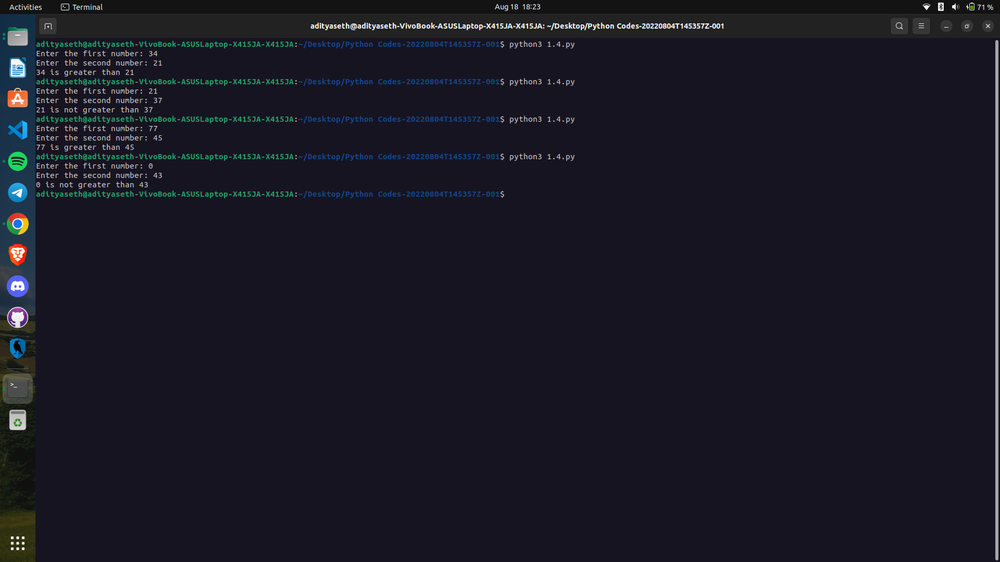

```
Explanation ->
The given Python script takes two numbers as input from the user, compares them, and then provides an explanation based on the comparison. Here's a breakdown of the script:

a = int(input("Enter the first number: ")): This line prompts the user to enter the first number. The input() function is used to receive user input as a string, and the entered value is converted to an integer using the int() function. The resulting integer is assigned to the variable a.

b = int(input("Enter the second number: ")): Similarly, this line prompts the user to enter the second number. The entered value is also converted to an integer and assigned to the variable b.

if a > b:: This line begins an if statement to compare a and b. If a is greater than b, the code block inside the if statement will be executed.

print(a, "is greater than", b): If a is greater than b, this line will be executed. It uses the print() function to display the value of a, followed by the string "is greater than", and finally the value of b. For example, if a is 5 and b is 3, the output will be "5 is greater than 3".

else:: If a is not greater than b, the code block inside the else statement will be executed.

print(a, "is not greater than", b): In the else block, this line is executed. It uses the print() function to display the value of a, followed by the string "is not greater than", and finally the value of b. For example, if a is 3 and b is 5, the output will be "3 is not greater than 5".

The script compares the two numbers entered by the user and provides an explanation based on the result of the comparison. If the first number is greater than the second number, it prints that the first number is greater. Otherwise, it prints that the first number is not greater than the second number.
```

Output ->

