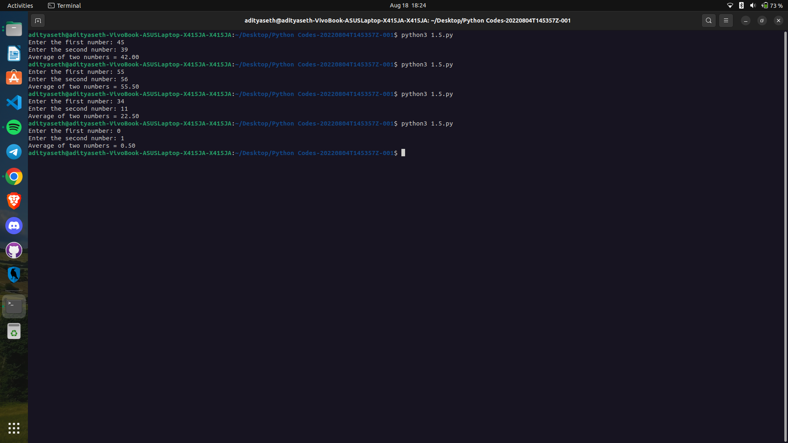

```
Explanation ->
The given Python script calculates the average of two numbers entered by the user and then displays the result. Let's break down the code step by step:

a = int(input("Enter the first number: ")): This line prompts the user to enter the first number. The input() function is used to receive user input as a string, and the entered value is converted to an integer using the int() function. The resulting integer is assigned to the variable a.

b = int(input("Enter the second number: ")): Similarly, this line prompts the user to enter the second number. The entered value is also converted to an integer and assigned to the variable b.

avg = (a + b) / 2: This line calculates the average of the two numbers by adding the values of a and b and then dividing the sum by 2. The result is stored in the variable avg.

print("Average of two numbers = %.2f" % avg): Finally, this line prints the calculated average. The print() function is used to display the output, which includes the string "Average of two numbers = " followed by the value of avg. The %.2f is a formatting placeholder that specifies the display of the float value with two decimal places.

The script takes two numbers as input, calculates their average, and then displays the average value with two decimal places.
```

Output ->

