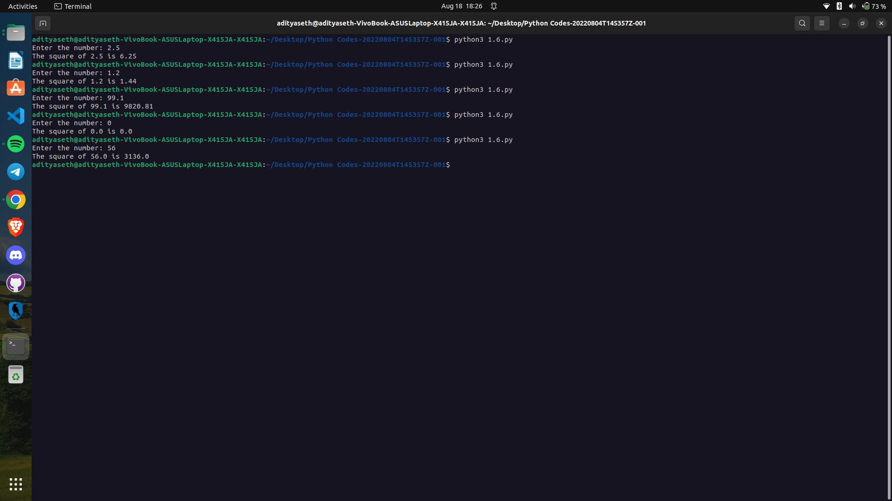

```
Explanation ->
The given Python code takes a number as input from the user, calculates the square of that number, and then displays the result. Here's a step-by-step explanation of the code:

a = float(input("Enter the number: ")): This line prompts the user to enter a number. The input() function is used to receive user input as a string, and the entered value is converted to a floating-point number using the float() function. The resulting float value is assigned to the variable a.

square = a * a: This line calculates the square of the number entered by multiplying a by itself. The result is stored in the variable square.

print("The square of", a, "is", square): Finally, this line prints the calculated square. The print() function is used to display the output. It prints the string "The square of", followed by the value of a, the string "is", and finally the value of square. For example, if a is 3.5, the output will be "The square of 3.5 is 12.25".

The script takes a number as input, calculates its square, and then displays the original number and its square to the user.
```

Output ->

