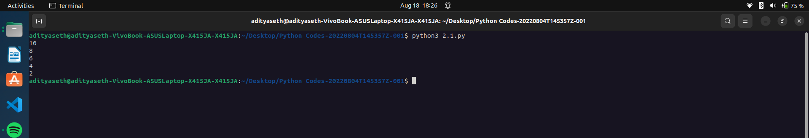

# Printing Numbers in Reverse Order

This Python program demonstrates a loop that prints numbers in reverse order, starting from a given value and decrementing by a specific amount.

## How it Works

1. The program initializes the variable `a` with a value of 10.
2. The program enters a loop that continues as long as `a` is greater than or equal to 2.
3. Inside the loop, the program prints the current value of `a`.
4. The program then decrements the value of `a` by 2.
5. The loop repeats until `a` is no longer greater than or equal to 2.
6. The program terminates after printing all the numbers in reverse order.

## Example Output

10  
8  
6  
4  
2

## Caption

"Printing Numbers in Reverse Order using a Loop in Python"

This program demonstrates the use of a loop in Python to print numbers in reverse order. It showcases the use of a while loop and variable manipulation to achieve the desired output. The program can be useful in situations where reversing a sequence of numbers or performing a countdown is required.

Output ->

