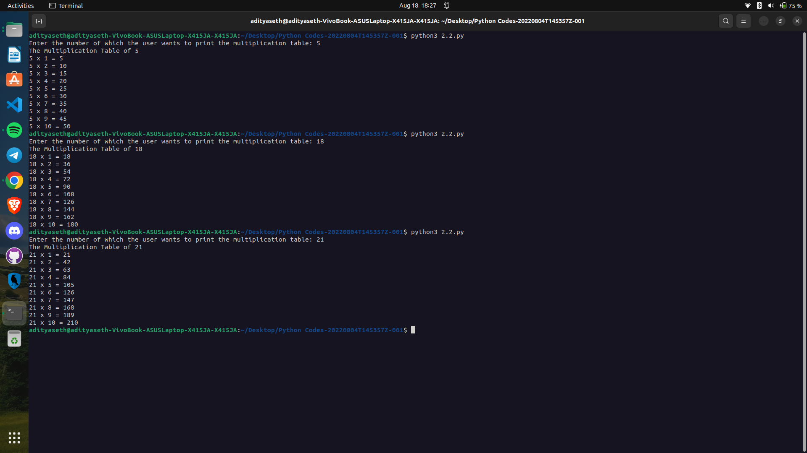

```
Explanation ->
The given Python code takes a number as input from the user and prints the multiplication table for that number. Here's a step-by-step explanation of the code:

number = int(input("Enter the number of which the user wants to print the multiplication table: ")): This line prompts the user to enter a number. The input() function is used to receive user input as a string, and the entered value is converted to an integer using the int() function. The resulting integer value is assigned to the variable number.

print("The Multiplication Table of", number, " "): This line prints a header for the multiplication table, indicating which number's table is being displayed.

for count in range(1, 11):: This line starts a for loop that iterates 10 times. The loop variable count takes values from 1 to 10 (inclusive). It represents the multiplier for the multiplication table.

print(number, 'x', count, '=', number * count): Inside the loop, this line prints each line of the multiplication table. It displays the multiplication expression in the format number x count = number * count. For example, if number is 5 and count is 3, the output will be "5 x 3 = 15". This line is executed 10 times, generating the complete multiplication table for the specified number.

The code takes a number as input, then uses a for loop to iterate through the numbers 1 to 10. It calculates and prints the multiplication table for the input number, displaying each line with the multiplication expression and the result.
```

Output ->

