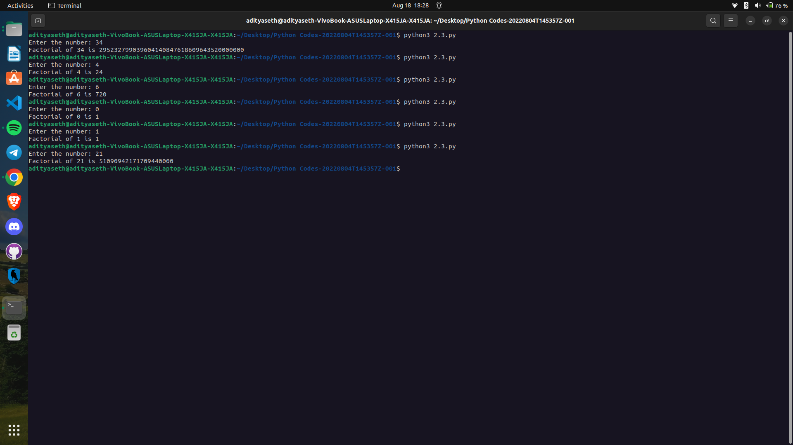

# Factorial Calculation

This Python program calculates the factorial of a given number using a recursive function.

## How it Works

1. The program defines a recursive function called `factorial` that takes a parameter `n`.
2. Inside the function, it uses a conditional expression (`if`) to check if `n` is either 0 or 1.
3. If `n` is 0 or 1, the function returns 1 (base case).
4. Otherwise, the function recursively calls itself with the parameter `n - 1` and multiplies it with `n` (recursive case).
5. The program prompts the user to enter a number and stores it in the variable `num`.
6. The program calls the `factorial` function with `num` as an argument and prints the factorial of `num` along with an explanatory message.

## Example Usage

Enter the number: 5

Factorial of 5 is 120

## Caption

"Calculating Factorial using Recursive Function in Python"

This program demonstrates the use of a recursive function to calculate the factorial of a number. It showcases the concept of recursion, where a function calls itself to solve a smaller instance of the same problem. The program can be used to calculate factorials for various mathematical or computational tasks.

Output ->

