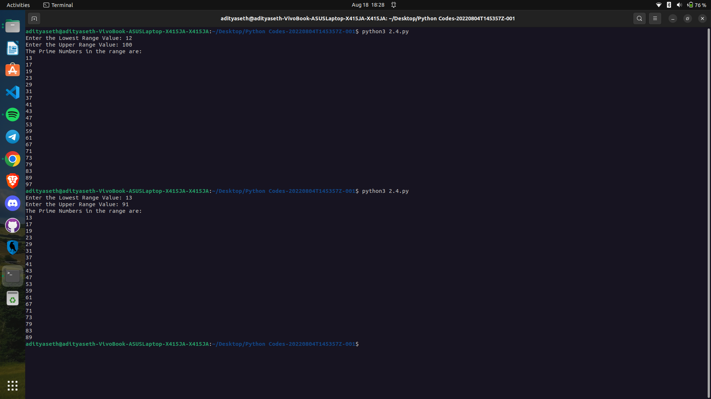

# Prime Numbers Finder

This Python program is designed to find and display prime numbers within a given range. The user is prompted to enter the lower and upper range values, and the program then identifies and prints all prime numbers within that range.

## How it Works

1. The program prompts the user to enter the lowest range value and stores it in the variable `lower_value`.
2. The program prompts the user to enter the upper range value and stores it in the variable `upper_value`.
3. The program then iterates through each number in the range from `lower_value` to `upper_value + 1` using a `for` loop.
4. For each number in the range, the program checks if the number is greater than 1 using an `if` statement.
5. If the number is greater than 1, the program proceeds to check if it is divisible by any number between 2 and the number itself using a nested `for` loop.
6. If the number is divisible by any of the values in the nested loop, it is not a prime number and the loop is terminated using the `break` statement.
7. If the number is not divisible by any of the values in the nested loop, it is a prime number and the program prints it.
8. The program continues this process for all numbers in the given range.
9. Once all the prime numbers within the range have been found and printed, the program terminates.

## Example Usage

Enter the Lowest Range Value: 10  
Enter the Upper Range Value: 30  

The Prime Numbers in the range are:  
11  
13  
17  
19  
23  
29

## Caption

"Finding Prime Numbers within a Range"

This program efficiently identifies and displays all prime numbers within a given range. It demonstrates the use of nested loops, conditional statements, and iteration techniques in Python. By understanding and utilizing prime numbers, this program can be beneficial for various mathematical computations and algorithms.

Output ->

