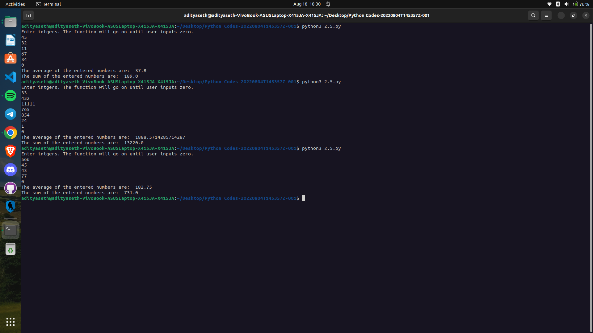

# Average and Sum Calculator

This Python program prompts the user to input a series of integers until the user enters zero. Then, it calculates the average and sum of the entered numbers.

## How it Works

1. The program starts by displaying a message to the user, instructing them to enter integers. The program will continue accepting input until the user inputs zero.
2. Inside the `while` loop, the program initializes variables `count` and `sum` to keep track of the number of inputs and the running sum, respectively.
3. The program prompts the user to enter a number and stores it in the variable `number`.
4. The program adds the entered number to the `sum` and increments the `count` by 1.
5. If the `count` is zero, the program displays a message indicating that no numbers were entered.
6. Otherwise, the program calculates the average by dividing the `sum` by `count-1` (excluding the zero input) and displays the result.
7. Finally, the program displays the total sum of the entered numbers.

## Example Usage

Enter integers. The function will go on until the user inputs zero.  
1  
5  
2  
0

The average of the entered numbers is: 2.6666666666666665  
The sum of the entered numbers is: 8

## Caption

"Calculating Average and Sum of Entered Numbers in Python"

This program allows the user to input a series of integers until zero is entered. It then calculates and displays the average and sum of the entered numbers. The program demonstrates the use of a `while` loop, input validation, and variable manipulation in Python. It can be useful for calculating average or sum values in various applications or data processing tasks.

Output ->

