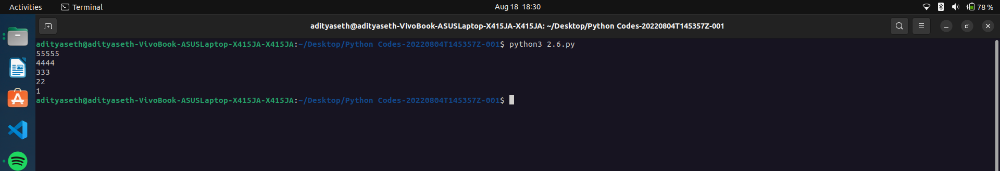

# Pattern Printing - Descending Numbers

This Python program prints a pattern of descending numbers using nested loops.

## How it Works

1. The outer `for` loop iterates from 5 to 1, decrementing by 1 in each iteration.
2. The inner `for` loop iterates from 0 to the current value of `i`.
3. Inside the inner loop, the program prints the current value of `i`, which represents the number to be printed.
4. The `end=""` argument ensures that the numbers are printed side by side without a newline character.
5. After printing all the numbers in the inner loop, the program executes a `print()` statement without any arguments to print a newline character, which moves the cursor to the next line.
6. The outer loop repeats until all numbers are printed in the desired pattern.

## Example Output

55555  
4444  
333  
22  
1

## Caption

"Printing Descending Numbers Pattern in Python"

This program demonstrates the use of nested loops to print a pattern of descending numbers. The number of times a digit is repeated in each row corresponds to its value. The program showcases the use of nested loops, loop control, and print formatting in Python. It can be used to generate visually interesting patterns or for educational purposes.

Output ->

