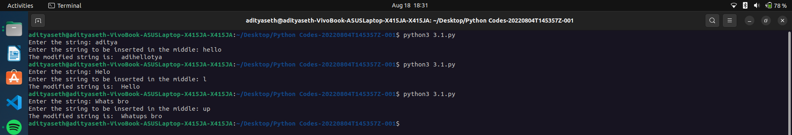

# String Modification - Insertion in the Middle

This Python program prompts the user to enter a string and inserts another string in the middle of it.

## How it Works

1. The program prompts the user to enter a string and stores it in the variable `s`.
2. The program defines a function called `mid` that takes a string as an argument.
3. Inside the `mid` function, it calculates the index of the middle element of the string by dividing the length of the string by 2.
4. The program prompts the user to enter the string to be inserted in the middle and stores it in the variable `c`.
5. The program creates a modified string (`ms`) by concatenating the substring of `str` from the start to the middle index (`str[:i]`), the string `c`, and the substring of `str` from the middle index to the end (`str[i:]`).
6. Finally, the program prints the modified string.

## Example Usage

Enter the string: Hello  
Enter the string to be inserted in the middle: World  
The modified string is: HeWorldllo

## Caption

"Inserting a String in the Middle of Another String in Python"

This program allows the user to enter a string and inserts another string in the middle of it. It demonstrates the use of string manipulation, slicing, and concatenation in Python. The program can be useful for modifying strings or inserting additional content into existing strings dynamically.

Output ->

