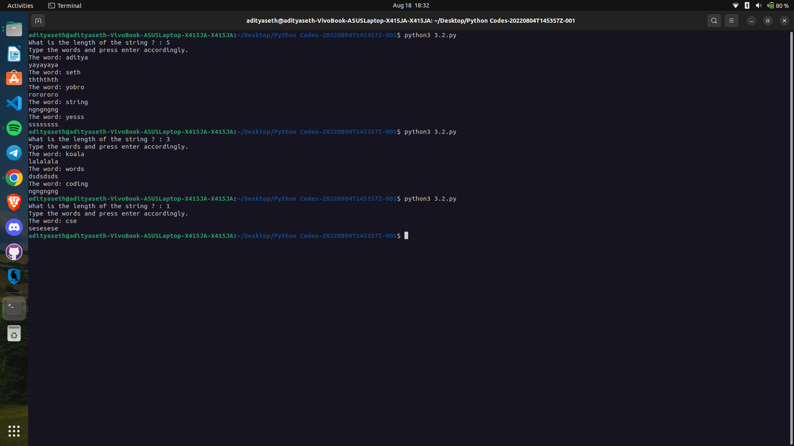

# String Manipulation - Inserting Substring at the End

This Python program prompts the user to enter multiple words and inserts the last two characters of each word four times.

## How it Works

1. The program prompts the user to enter the length of the string (`num`) they want to work with.
2. Inside a loop that iterates `num` times, the program prompts the user to enter a word and stores it in the variable `a`.
3. The program calls the `insert_end` function, passing the word as an argument.
4. The `insert_end` function takes a string as input and extracts the last two characters using slicing (`str[-2:]`).
5. It then prints the extracted substring four times using the multiplication operator (`*`).
6. The loop continues until all words are processed.

## Example Usage

What is the length of the string?: 3
Type the words and press enter accordingly.
The word: Hello
lo lololo
The word: Python
on ononon
The word: OpenAI
AI AIAIAI

## Caption

"Inserting Substring at the End of Words in Python"

This program prompts the user to enter multiple words and inserts the last two characters of each word four times. It showcases the use of string manipulation, slicing, and repetition in Python. The program can be used to modify strings or extract specific portions of words dynamically in various text processing scenarios.

Output ->

