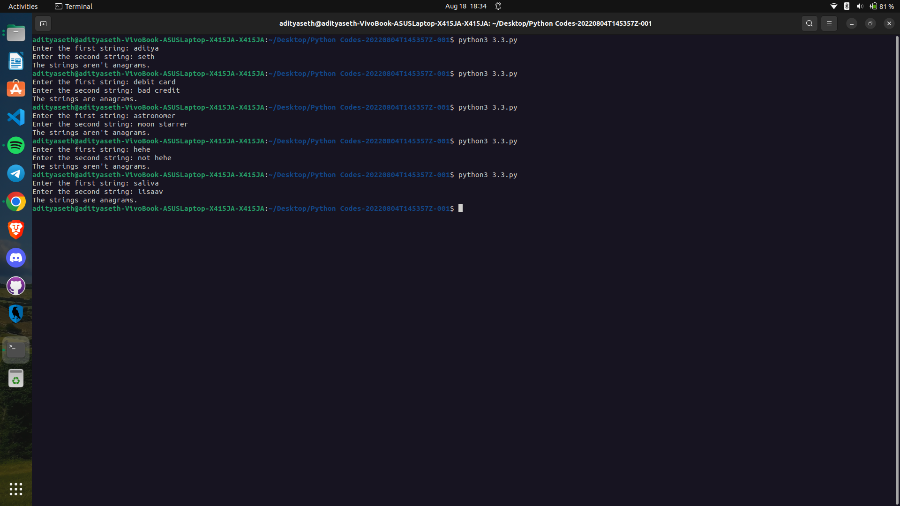

# Anagram Checker

This Python program checks whether two strings are anagrams or not.

## How it Works

1. The program defines a function called `check` that takes two strings (`s1` and `s2`) as arguments.
2. Inside the `check` function, it compares the sorted versions of `s1` and `s2` using the `sorted()` function.
3. If the sorted strings are equal, it means that the original strings contain the same characters and quantities, and thus, they are anagrams.
4. The program prints the appropriate message based on the result of the comparison.

## Example Usage

Enter the first string: listen
Enter the second string: silent
The strings are anagrams.

## Caption

"Checking Anagrams in Python"

This program prompts the user to enter two strings and checks whether they are anagrams or not. Anagrams are words or phrases formed by rearranging the letters of another word or phrase. The program utilizes the sorted function to sort the characters in the strings and compares them for equality. It demonstrates a simple yet effective way to determine anagram relationships between strings in Python.

Output ->

