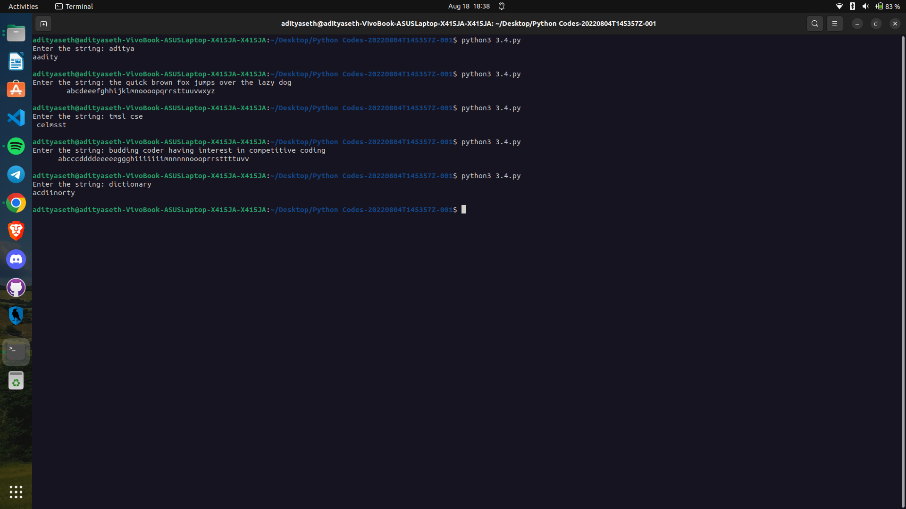

# String Sorting - Alphabetic Order

This Python program prompts the user to enter a string and prints its characters in alphabetical order.

## How it Works

1. The program prompts the user to enter a string and stores it in the variable `s`.
2. It initializes an empty list `l` and converts the string `s` into a list of characters using the `list()` function.
3. The program sorts the list `l` in ascending order using the `sort()` method.
4. It then iterates over the sorted list and prints each character using the `print()` function with the `end=""` argument to ensure the characters are printed side by side without a newline character.
5. Finally, the program prints a newline character to move the cursor to the next line.

## Example Usage

Enter the string: openai
aeinop

## Caption

"Sorting Characters in a String in Python"

This program allows the user to enter a string and prints its characters in alphabetical order. It showcases the use of lists, sorting, and iteration in Python. The program can be used to sort and analyze strings, perform character-based operations, or for educational purposes.

Output ->

