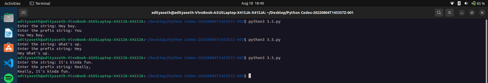

# Multi-Line Prefix Addition

This Python program prompts the user to enter a multi-line string and adds a prefix string to each line.

## How it Works

1. The program prompts the user to enter a multi-line string and stores it in the variable `s`.
2. It initializes an empty list `l` and splits the string `s` into individual lines using the `split()` method with the delimiter `.`.
3. The program prompts the user to enter a prefix string and stores it in the variable `ps`.
4. It iterates over each line in the list `l`, except the last one.
5. Inside the loop, it concatenates the prefix string `ps` with the current line (`ps+l[i]`) and prints it, followed by a dot (`.`), using the `print()` function with the `end="."` argument to ensure the lines are printed in a single line with dots in between.
6. Finally, it prints the last line in the list `l` without the prefix string.

## Example Usage

Enter the string:
Hello.
How are you?
I'm fine.

Enter the prefix string: Prefix
PrefixHello.PrefixHow are you?.PrefixI'm fine.

## Caption

"Adding a Prefix to Each Line of a Multi-Line String in Python"

This program allows the user to enter a multi-line string and adds a prefix string to each line. It demonstrates the use of string manipulation, splitting, and iteration in Python. The program can be used to modify multi-line strings, add identifiers to each line, or manipulate text data with line-based operations.

Output ->

