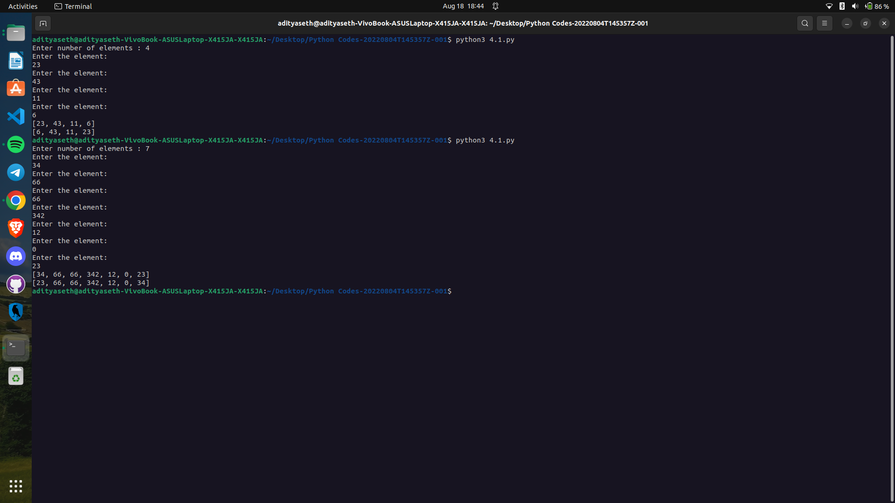

# Swapping First and Last Elements in a List

This Python program allows the user to create a list of numbers and swaps the first and last elements in the list.

## How it Works

1. The program initializes an empty list `lst` to store the elements.
2. It prompts the user to enter the number of elements (`n`) they want to add to the list.
3. Using a loop, the program iterates `n` times and prompts the user to enter each element, which is then appended to the list using the `append()` method.
4. After all the elements are added, the program prints the original list.
5. It defines a function `swapList` that takes the list `lst` as input.
6. Inside the `swapList` function, the program calculates the size of the list using the `len()` function.
7. It swaps the first and last elements of the list by assigning the first element to a temporary variable (`temp`), then assigning the last element to the first position, and finally assigning the temporary variable to the last position.
8. The function returns the modified list.
9. The program calls the `swapList()` function with the original list `lst` as an argument and prints the resulting swapped list.

## Example Usage

Enter number of elements: 5
Enter the element:
10
Enter the element:
20
Enter the element:
30
Enter the element:
40
Enter the element:
50
Original List: [10, 20, 30, 40, 50]
Swapped List: [50, 20, 30, 40, 10]

## Caption

"Swapping the First and Last Elements of a List in Python"

This program allows the user to create a list of numbers and swaps the first and last elements in the list. It demonstrates the use of list creation, element appending, and swapping in Python. The program can be used to modify lists, reorder elements, or perform list-based operations in various applications.

Output ->

